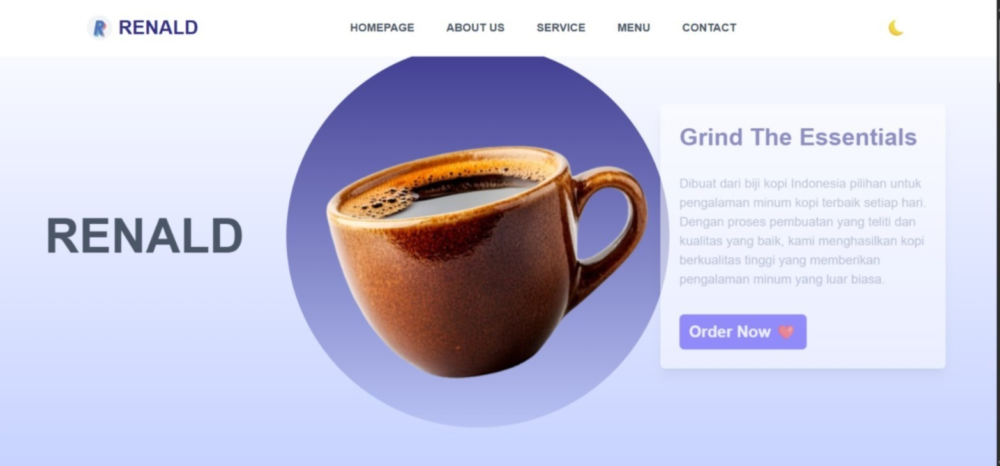
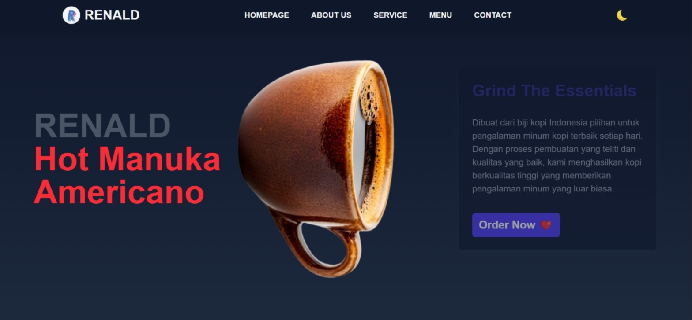
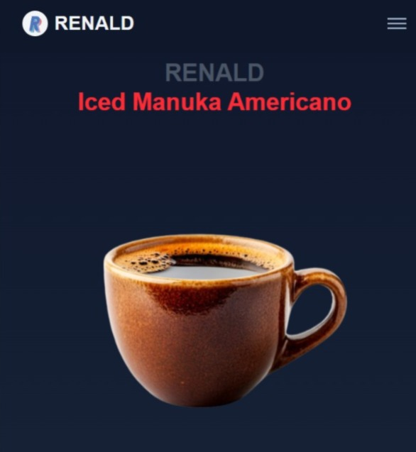

# Hi Everyone, I'm Renald 👋

# Tailwind 4 | JavaScript

This is a coffee shop web project that I made myself. This web has a light mode and a dark mode. Besides that the web is responsive to mobile and desktop sizes.

## Screenshots







## 🚀 About Me

I'm a Frontend Developer | Fullstack Developer...

## Demo

http://127.0.0.1:5501/

## Run Locally

Clone the project

```bash
  git clone https://link-to-project
```

Go to the project directory

```bash
  cd tailwindcss-coffee-renald
```

Install dependencies

```bash
  npm install
```

Start the server

```bash
  npm run dev
```

## Feedback

If you have any feedback, please reach out to us at avryso@gmail.com
